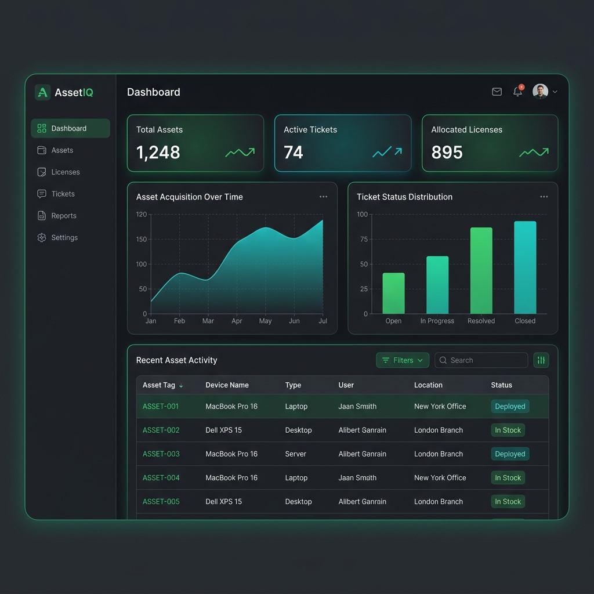

# AssetIQ - IT Asset Management System (Frontend)

AssetIQ is a state-of-the-art IT Asset Management and support ticket platform built on **Next.js**, **React**, and **Tailwind CSS**. It provides location-scoped inventory tracking, automated support ticket assignment workflows, and comprehensive reporting dashboards.



## 📋 Table of Contents

- [Core Features](#-core-features)
- [Tech Stack](#%EF%B8%8F-tech-stack)
- [Prerequisites](#-prerequisites)
- [Getting Started](#-getting-started)
- [Configuration](#%EF%B8%8F-configuration)
- [Project Structure](#-project-structure)
- [Role-Based Access Control (RBAC)](#-role-based-access-control-rbac)
- [Reporting & Export System](#-reporting--export-system)
- [Multi-Language Architecture](#-multi-language-architecture)

---

## 🚀 Core Features

- **Interactive Reporting Dashboards**: Dedicated pages with rich telemetry, interactive charts (Recharts), and advanced analytics for assets, tickets, and software licenses.
- **Support Ticket Workflows**: Seamless ticket lifecycle management starting with "Pending Assignment" and transitioning through assignment and resolution with custom permissions.
- **Granular Permissions & Scope**: Interfaces adapt automatically to Super Admin, Location Admin, and Regular User authorization levels.
- **Localization**: Full support for internationalization with English and Arabic locales.
- **High-Performance Exports**: One-click download of Excel (`.xlsx`) and PDF (`.pdf`) documents generated dynamically by the backend reports engine.

---

## 🛠️ Tech Stack

- **Framework**: [Next.js](https://nextjs.org/) (App Router)
- **Library**: [React.js](https://react.dev/)
- **Styling**: [Tailwind CSS](https://tailwindcss.com/)
- **Icons**: [Lucide React](https://lucide.dev/)
- **Data Visualization**: [Recharts](https://recharts.org/)
- **HTTP Client**: Native Fetch API with structured helper middleware

---

## 📦 Prerequisites

- **Node.js** (v18.0.0 or higher recommended)
- **npm** (v9.0.0 or higher)
- **AssetIQ Backend API** running locally or in a staging environment

---

## 📂 Getting Started

### 1. Clone & Install

```bash
git clone <repository-url>
cd assetiq_frontend
npm install
```

### 2. Configure Environment

Create a `.env.local` file in the root directory:

```ini
NEXT_PUBLIC_API_URL=http://localhost:5003/api
```

### 3. Run Development Server

```bash
npm run dev
```

Open [http://localhost:3000](http://localhost:3000) in your browser to view the application.

### 4. Production Build

To compile a production build:

```bash
npm run build
npm start
```

---

## ⚙️ Configuration

The frontend connects to the backend API defined in `NEXT_PUBLIC_API_URL`. All request headers automatically resolve authorization tokens stored in `localStorage` (`assetiq_token`).

---

## 🗂️ Project Structure

```
assetiq_frontend/
├── src/
│   ├── app/                # Next.js App Router (pages & routing)
│   │   ├── dashboard/      # Main Dashboard view
│   │   ├── reports/        # Advanced Reporting & Exports
│   │   ├── tickets/        # Ticket Management & Workflow
│   │   └── page.js         # Landing / Login gate
│   ├── components/         # Reusable UI components
│   │   ├── AppLayout.js    # Layout wrapper with sidebar navigation
│   │   └── SearchableSelect.js # Custom dropdown filters
│   ├── context/            # React Global States
│   │   ├── AuthContext.js  # JWT Auth & Role scoping
│   │   └── LanguageContext.js # Dynamic English/Arabic translations
│   └── lib/
│       └── api.js          # API client mapping endpoints
└── public/
    └── images/             # Static graphics assets
```

---

## 🔐 Role-Based Access Control (RBAC)

The UI dynamically updates layout links, controls, and active buttons based on the user's role:
- **Super Admin**: Complete site visibility, organization-wide inventory management, and ticketing oversight.
- **Location Admin**: Location-scoped access to assets, users, and ticket assignment tasks for their specific site.
- **User**: View assigned assets, submit new tickets, and view their personal audit trail.

---

## 📊 Reporting & Export System

The **Reports** module (`src/app/reports/page.js`) features tabs for:
1. **Asset Inventory**: Location, brand, tag, and assignment logs.
2. **Asset Allocations**: Allocation history and return timestamps.
3. **Tickets**: Support query metrics, categories, priority, and assignees.
4. **Licenses**: Key mapping, software names, and valid-to parameters.
5. **Audit Logs**: Secure log records showing user activities.

Exports are performed by posting current search and filter payloads directly to the backend endpoint `/reports/export`. The backend responds with the compiled document binary, which is then immediately downloaded client-side.

---

## 🌐 Multi-Language Architecture

The system uses `LanguageContext` to support a client-side dictionary.
- Translates dynamic headings, forms, tables, and buttons instantly.
- Automatically adjusts document orientation if necessary for RTL languages (e.g. Arabic).
